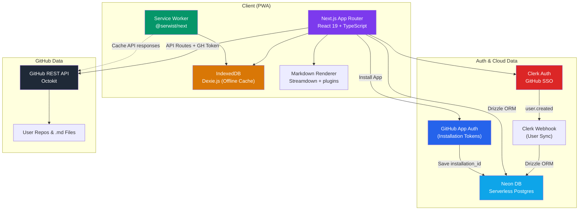

# InkDown — A Kindle-Like GitHub Markdown Reader

A premium, offline-first PWA that turns your GitHub markdown files into a beautiful, immersive reading experience — like Kindle for your knowledge base.

## User Review Required

> [!IMPORTANT]
> **GitHub App Setup**: We will use a GitHub App for secure, granular access to private repositories. You will need to create a GitHub App in your developer settings with `Contents: Read-only` permissions and configure it with a Setup URL. We'll need the App ID, Client ID, Client Secret, and Private Key.

> [!IMPORTANT]
> **Clerk Auth Setup**: Clerk handles identity. You will configure the GitHub provider in your Clerk dashboard for basic login (no extra scopes needed) and get `NEXT_PUBLIC_CLERK_PUBLISHABLE_KEY` and `CLERK_SECRET_KEY`.

> [!IMPORTANT]
> **Vercel Deployment**: The app will be configured for Vercel deployment. You'll need a Vercel account and to connect your repo.

> [!NOTE]
> **Clerk & Neon DB Auto-Sync**: Per your request, the app will use Clerk for authentication (with GitHub OAuth) and Neon DB (Serverless Postgres) for database auto-sync. User data (reading progress, highlights, etc.) will be stored in Neon DB. 

## Open Questions

> [!IMPORTANT]
> **App Name**: I'm proposing "InkDown" (Ink + Markdown). Do you like it, or do you have a name in mind?

---

## Architecture Overview



---

## Tech Stack Decision Matrix

| Concern | Choice | Why |
|---------|--------|-----|
| **Framework** | Next.js 15 (App Router) | SSR for fast initial load, API routes for OAuth, Vercel-native |
| **Auth** | Clerk (with GitHub provider) | Enterprise-grade auth, built-in components, webhook sync |
| **Cloud Database** | Neon DB (Serverless Postgres) | Fast connection times via HTTP driver, pairs perfectly with Drizzle & Vercel |
| **ORM** | Drizzle ORM | Lightweight, type-safe SQL wrapper to query Neon DB securely from server actions |
| **PWA & Offline Storage** | @serwist/next & Dexie.js | Modern service worker integration + robust IndexedDB wrapper for offline caching |
| **Markdown** | Streamdown + plugins | Drop-in React component, built on remark/rehype, handles GFM, streaming, security |
| **UI Components** | Shadcn UI | *(Per user request)*: Dramatically accelerates UI development by providing accessible, pre-built components (dropdowns, modals, sliders) that we can easily customize with Tailwind. Results in highly polished UX with less boilerplate code. |
| **Styling** | Tailwind CSS v4 | Required by Streamdown and Shadcn. Excellent utility-first approach for rapid styling. |

---

## Proposed Changes

### 1. Project Scaffolding & Configuration

#### [NEW] `package.json`
Next.js 15 project with dependencies:
- `next`, `react`, `react-dom` (core)
- `@clerk/nextjs` (Authentication)
- `@neondatabase/serverless`, `drizzle-orm`, `drizzle-kit` (Database)
- `svix` (Webhook verification)
- `@serwist/next`, `serwist` (PWA/service worker)
- `@octokit/rest`, `@octokit/auth-app` (GitHub API & App Auth)
- `streamdown`, plugins... (MD rendering)
- `tailwindcss`, `lucide-react`, `class-variance-authority`, `clsx`, `tailwind-merge` (Shadcn UI requirements)
- `dexie`, `dexie-react-hooks` (Offline Cache)

#### [NEW] `next.config.ts`
- Wrap with `withSerwist()` for PWA support

#### [NEW] `.env.example`
```
NEXT_PUBLIC_CLERK_PUBLISHABLE_KEY=
CLERK_SECRET_KEY=
CLERK_WEBHOOK_SECRET=
DATABASE_URL=
NEXT_PUBLIC_GITHUB_APP_NAME=
GITHUB_APP_ID=
GITHUB_APP_CLIENT_ID=
GITHUB_APP_CLIENT_SECRET=
GITHUB_APP_PRIVATE_KEY=
```

---

### 2. Authentication & Auto-Sync (Clerk + Neon DB)

#### [NEW] `lib/db.ts` & `lib/schema.ts`
Drizzle ORM setup connecting to Neon DB via HTTP driver.
Schema defines tables for `users` (synced from Clerk), `reading_progress`, `highlights`, and `bookmarks`.
The `users` table will include a `github_installation_id` column to store the user's GitHub App installation ID.

#### [NEW] `app/api/webhooks/clerk/route.ts`
Next.js API route that listens for Clerk webhooks (`user.created`, `user.updated`).
Verifies payload using Svix and `CLERK_WEBHOOK_SECRET`.
Upserts user data into Neon DB using Drizzle ORM.

#### [NEW] `middleware.ts`
Clerk middleware to protect `/library` and `/read` routes, while allowing public access to the webhook endpoint and GitHub setup redirect endpoint.

---

### 2.5. GitHub App Setup Flow

#### [NEW] `app/api/github/setup/route.ts`
Next.js API route that handles the redirect back from the GitHub App installation flow.
It will capture the `installation_id` from the URL, verify the authenticated Clerk user, and update their `users` record in Neon DB with this ID.

#### [NEW] `app/setup/page.tsx`
A setup page for users who have logged in via Clerk but haven't installed the GitHub App yet. It displays a clear call-to-action explaining why the app needs repository access and provides a button linking to `https://github.com/apps/{app-name}/installations/new`.

---

### 3. Design System (CSS)

#### [NEW] `app/globals.css`
Complete design system with CSS custom properties:

**Theme tokens** (5 reading themes):
| Theme | Background | Text | Accent |
|-------|-----------|------|--------|
| Light | `#fefefe` | `#1a1a2e` | `#7c3aed` |
| Dark | `#0f0f13` | `#e4e4e7` | `#a78bfa` |
| Sepia | `#f4ecd8` | `#5b4636` | `#8b6914` |
| Night | `#0a0a0f` (blue-filtered) | `#c9a96e` | `#d4a853` |
| Forest | `#0d1f0d` | `#b8d4b8` | `#4ade80` |

**Typography scale**: Fluid type from 14px–24px (reader), with system for body/code/heading fonts

**Animation tokens**: Transitions, easing curves, micro-animation durations

**Component styles**: Cards, buttons, modals, sliders, progress bars, toast notifications

---

### 4. Offline Storage Layer (Dexie.js / IndexedDB)

#### [NEW] `lib/offline-db.ts`
Dexie database schema:

```typescript
// Tables:
cachedFiles: '++id, repoFullName, filePath, content, fetchedAt'
readingProgress: '++id, fileId, scrollPercent, lastReadAt'
highlights: '++id, fileId, startOffset, endOffset, color, text, createdAt'
bookmarks: '++id, fileId, scrollPercent, label, createdAt'
recentlyRead: '++id, fileId, repoFullName, filePath, lastReadAt'
likedFiles: '++id, fileId, repoFullName, filePath, likedAt'
settings: 'key, value'  // theme, fontSize, fontFamily, autoScrollSpeed
```

#### [NEW] `lib/db-hooks.ts`
React hooks wrapping Dexie for reactive data:
- `useReadingProgress(fileId)` — get/set scroll position
- `useHighlights(fileId)` — CRUD highlights
- `useBookmarks(fileId)` — CRUD bookmarks
- `useSettings()` — get/set reader preferences
- `useRecentlyRead()` — reading history
- `useLikedFiles()` — favorited documents

---

### 5. GitHub Integration

#### [NEW] `lib/github.ts`
GitHub API service using `@octokit/rest` and `@octokit/auth-app`:
- Generates Installation Access Tokens using the GitHub App's private key and the user's `github_installation_id` from the database.
- `getUserRepos(installationId, page)` — list repos the app has been granted access to.
- `searchRepos(installationId, query)` — search within installed repos.
- `getRepoTree(installationId, owner, repo)` — get full file tree, filter `.md` files.
- `getFileContent(installationId, owner, repo, path)` — fetch raw markdown content.
- Everything runs server-side via Next.js Server Actions or API Routes so the private key never reaches the client.

#### [NEW] `lib/github-cache.ts`
Caching layer on top of GitHub API:
- Cache file contents in IndexedDB with `fetchedAt` timestamp
- Stale-while-revalidate: serve cached immediately, update in background
- ETags for conditional requests (save API rate limit)

---

### 6. Markdown Rendering (Streamdown)

#### [NEW] `components/MarkdownRenderer.tsx`
Streamdown-based React component:
- `<Streamdown>` component renders markdown with built-in GFM, typography, and security
- `@streamdown/code` plugin for Shiki syntax highlighting
- `@streamdown/math` plugin for KaTeX LaTeX rendering
- `@streamdown/mermaid` plugin for diagram rendering
- Custom renderers for headings (inject anchor IDs for TOC)
- Custom renderers for images (lazy loading, zoom on tap)

#### [NEW] `lib/reading-utils.ts`
Utilities that sit alongside the renderer:
- Auto-generate Table of Contents from heading elements (post-render DOM parsing)
- Calculate estimated reading time (words / 250 wpm)
- Extract plain text for TTS from rendered content

#### Tailwind Setup for Streamdown
In `app/globals.css`, add the Streamdown `@source` directive so Tailwind scans its styles:
```css
@import "tailwindcss";
@source "../node_modules/streamdown/dist/*.js";
@source "../node_modules/@streamdown/code/dist/*.js";
@source "../node_modules/@streamdown/math/dist/*.js";
@source "../node_modules/@streamdown/mermaid/dist/*.js";
```
Our reading themes (light/dark/sepia/night/forest) remain as **CSS custom properties** on `[data-theme]`, which override Streamdown's default colors in the reader view.

---

### 7. App Pages & Components

#### [NEW] `app/layout.tsx`
Root layout:
- HTML lang, meta viewport for mobile
- Google Fonts: Literata (reading), Inter (UI), JetBrains Mono (code)
- Theme provider (CSS class on `<html>`)
- PWA meta tags

#### [NEW] `app/page.tsx` — Landing / Login Page
- Hero section with app description and animated preview
- "Sign in with GitHub" button
- Feature highlights (offline, themes, highlights, etc.)
- If already authenticated → redirect to `/library`

---

#### Library Experience

#### [NEW] `app/library/page.tsx` — Library Dashboard
**Sections:**
1. **Continue Reading** — Last opened documents with progress bars
2. **Liked** — User's favorited/liked markdown documents for quick access
3. **My Repos** — Grid of user's GitHub repos (only those containing .md files)

**Features:**
- Search bar to search repos or filter by name
- Grid/list view toggle
- Pull-to-refresh on mobile
- Skeleton loading states

#### [NEW] `app/library/[owner]/[repo]/page.tsx` — Repo File Browser
- Breadcrumb navigation
- Tree view of `.md` files in the repo
- File size, last modified date
- Click to open in reader
- "Read All" mode — concatenate all .md files into a single reading view

---

#### Reader Experience (Core Feature)

#### [NEW] `app/read/[owner]/[repo]/[...path]/page.tsx` — Reader Page
The main reading experience. This is where 80% of the UX magic happens.

**Layout:**
```
┌─────────────────────────────────────────────┐
│  ← Back    Title              ⚙ Settings    │  ← Minimal header (auto-hides on scroll)
├──────────┬──────────────────────────────────┤
│          │                                  │
│  TOC     │     Rendered Markdown            │  ← Clean, centered content
│  Panel   │     (max-width: 720px)           │     with generous margins
│ (toggle) │                                  │
│          │                                  │
│          │                                  │
├──────────┴──────────────────────────────────┤
│  ▓▓▓▓▓▓▓▓▓▓▓░░░░░░░░░░░░  42%  8 min left │  ← Progress bar (bottom)
└─────────────────────────────────────────────┘
```

**Reader Features:**
| Feature | Implementation |
|---------|---------------|
| **Auto-scroll** | `requestAnimationFrame` loop, speed 1-10 slider, pause on touch/click, resume button |
| **Theme switching** | 5 themes via CSS custom properties, smooth 300ms transition, persisted in IndexedDB |
| **Font controls** | Size (14-28px slider), Family (Literata/Georgia/OpenDyslexic/System), Line height (1.4-2.2) |
| **Highlighting** | `window.getSelection()` → save range offsets + color to IndexedDB → restore via `Range` API on load |
| **Bookmarks** | Tap bookmark icon at current scroll % → saved with optional label → jump back from panel |
| **Progress** | `IntersectionObserver` on content sections → percentage bar → persisted per file |
| **Search** | `Ctrl+F` override with custom search: highlights all matches, previous/next navigation |
| **TOC sidebar** | Auto-generated from `h1-h6` headings, highlights current section, click to scroll |
| **Reading time** | Word count / 250 wpm, updates "X min remaining" based on scroll position |
| **Night mode** | Blue-light filter: warm amber tint via CSS `filter` + reduced brightness |
| **Text-to-Speech** | Web Speech API `SpeechSynthesisUtterance`, voice selector, rate control, highlights current paragraph |
| **Keyboard shortcuts** | `Space` = page down, `Shift+Space` = page up, `T` = TOC, `S` = settings, `F` = search, `Esc` = close panels |

---

#### Settings Panel

#### [NEW] `components/SettingsPanel.tsx`
Slide-out panel (from right) with:
- **Appearance**: Theme picker (visual swatches), font size slider, font family dropdown, line height slider
- **Reading**: Auto-scroll speed, scroll direction
- **Text-to-Speech**: Voice selector, speed, pitch
- **Data**: Export highlights, clear cache, storage usage indicator

---

### 8. Key UI Components

#### [NEW] `components/ThemeProvider.tsx`
Client component: reads theme from IndexedDB, applies CSS class to `<html>`, provides `setTheme()` context

#### [NEW] `components/RepoCard.tsx`
Card for library grid: repo name, description, .md file count, last updated, reading progress ring

#### [NEW] `components/ProgressBar.tsx`
Bottom fixed bar: gradient fill, percentage text, "X min remaining"

#### [NEW] `components/AutoScroller.tsx`
Floating control: play/pause button, speed slider, elegant translucent design

#### [NEW] `components/HighlightToolbar.tsx`
Floating toolbar that appears on text selection: 4 color options (yellow, green, blue, pink), delete highlight

#### [NEW] `components/TOCSidebar.tsx`
Slide-out Table of Contents: generated from headings, active section indicator, smooth scroll on click

#### [NEW] `components/SearchOverlay.tsx`
Full-width search bar overlay: live search as you type, match count, prev/next navigation

#### [NEW] `components/TTSController.tsx`
Text-to-Speech controls: floating bottom bar with play/pause, skip paragraph, voice & speed settings

#### [NEW] `components/BookmarkPanel.tsx`
Slide-out panel listing all bookmarks for current document, with labels and jump-to functionality

---

### 9. Service Worker (PWA / Offline)

#### [NEW] `app/sw.ts`
Serwist service worker:
- **Precache**: App shell (HTML, CSS, JS, fonts)
- **Runtime cache strategies**:
  - GitHub API responses → `StaleWhileRevalidate` (serve cached, update in background)
  - Google Fonts → `CacheFirst` (fonts rarely change)
  - Images → `CacheFirst` with 30-day expiry
- **Offline fallback**: Custom `/~offline` page when no cache available
- **Background sync**: Queue failed API requests, retry when online

#### [NEW] `app/~offline/page.tsx`
Offline fallback page:
- "You're offline" message with airplane icon
- List of cached/previously read documents (from IndexedDB)
- User can continue reading any cached document

---

### 10. UX Polish & Micro-Animations

| Element | Animation |
|---------|-----------|
| Page transitions | Fade + slight upward slide (150ms ease-out) |
| Theme switch | Smooth color transition (300ms) across all elements |
| Settings panel | Slide in from right with backdrop blur |
| TOC sidebar | Slide in from left, current heading pulses |
| Highlight creation | Brief yellow flash → settles to chosen color |
| Progress bar | Smooth width transition, gradient shimmer |
| Auto-scroll toggle | Breathing glow effect when active |
| Repo cards (library) | Subtle scale on hover (1.02), shadow elevation |
| Reading time | Count-down animation as you scroll |
| Toast notifications | Slide up from bottom, auto-dismiss after 3s |

---

## File Structure

```
zealous-tesla/
├── app/
│   ├── layout.tsx                          # Root layout + fonts + theme
│   ├── page.tsx                            # Landing / login
│   ├── setup/page.tsx                      # GitHub App installation prompt
│   ├── globals.css                         # Design system + themes
│   ├── manifest.ts                         # PWA manifest
│   ├── sw.ts                               # Service worker
│   ├── ~offline/
│   │   └── page.tsx                        # Offline fallback
│   ├── api/
│   │   ├── auth/[...nextauth]/route.ts     # Auth.js handlers
│   │   ├── github/setup/route.ts           # GitHub App installation callback
│   │   └── webhooks/clerk/route.ts         # Clerk webhooks
│   ├── library/
│   │   ├── page.tsx                        # Library dashboard
│   │   └── [owner]/[repo]/
│   │       └── page.tsx                    # Repo file browser
│   └── read/
│       └── [owner]/[repo]/[...path]/
│           └── page.tsx                    # Reader view
├── components/
│   ├── ThemeProvider.tsx
│   ├── RepoCard.tsx
│   ├── ProgressBar.tsx
│   ├── AutoScroller.tsx
│   ├── HighlightToolbar.tsx
│   ├── TOCSidebar.tsx
│   ├── SearchOverlay.tsx
│   ├── TTSController.tsx
│   ├── BookmarkPanel.tsx
│   ├── SettingsPanel.tsx
│   └── SkeletonLoader.tsx
├── lib/
│   ├── db.ts                               # Dexie schema
│   ├── db-hooks.ts                         # React hooks for IndexedDB
│   ├── github.ts                           # GitHub API service
│   ├── github-cache.ts                     # Caching layer
│   └── markdown.ts                         # MD rendering pipeline
├── auth.ts                                 # Auth.js config
├── middleware.ts                           # Route protection
├── next.config.ts
├── tsconfig.json
├── package.json
├── .env.example
└── public/
    ├── icons/                              # PWA icons
    └── fonts/                              # Fallback fonts
```

---

## Verification Plan

### Automated Tests
```bash
npm run build        # Verify production build succeeds
npm run lint         # ESLint passes
npx tsc --noEmit     # TypeScript compiles without errors
```

### Continuous Integration Workflow (Git + AI Review)
I will execute the implementation using the following CI/CD process:
1. **Branching**: `git checkout -b feature/initial-implementation`
2. **Commit & Push**: Commit the code changes and push to GitHub.
3. **Pull Request**: Create a PR against `main` using the GitHub CLI (`gh pr create`).
4. **AI Vulnerability Review**: I will wait for your configured agents to review the PR code for vulnerabilities and leave comments.
5. **Fix & Merge**: I will read their comments, apply fixes if necessary, and then merge the PR using `gh pr merge`.
6. **Vercel Check**: I will verify the deployment build status on Vercel using the `vercel` CLI.

### Manual Verification
1. **Auth & Sync flow**: Sign in via Clerk → verify webhook fires → verify user row created in Neon DB.
2. **Library**: Browse repos → see .md files → open one in reader
3. **Reader features**: Test each feature individually (Themes, TOC, TTS, Auto-scroll, etc.). Verify that highlights and bookmarks sync to Neon DB.
4. **PWA**: Install on phone → verify offline reading works (pulls from Dexie cache, syncs to Neon when back online).
5. **Performance**: Lighthouse PWA audit → target 90+ score.

---

## Performance Targets

| Metric | Target |
|--------|--------|
| First Contentful Paint | < 1.2s |
| Largest Contentful Paint | < 2.5s |
| Total Bundle Size (gzipped) | < 200KB |
| Offline Load Time | < 500ms (from cache) |
| Lighthouse PWA Score | 90+ |
| Lighthouse Performance | 90+ |

## Estimated Scope

This is a **significant project** (~40-50 files). I'll build it methodically:
1. Scaffolding + auth (foundation)
2. GitHub integration + library (data layer)
3. Reader core + markdown rendering (main feature)
4. Reader features (highlights, bookmarks, TOC, search, TTS, auto-scroll)
5. PWA + offline support (service worker)
6. Polish (animations, responsive, performance)
